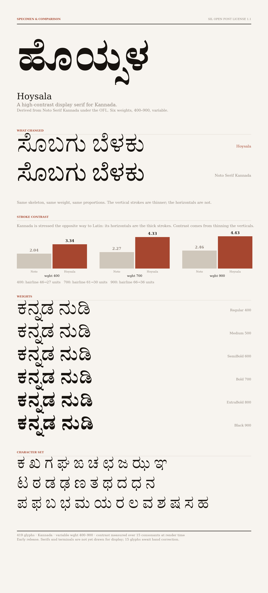

# Hoysala

Hoysala is a high-contrast display serif for Kannada and Latin.

It is named after the Hoysala dynasty, whose temples at Belur and Halebidu are
known for intricate, deeply undercut soapstone relief — a fitting reference for
a face built on sharp modulation and strong light-and-shadow.



Regenerate the sheet with `scripts/datasheet.py`. Every figure on it is
measured from the binaries at render time, so it cannot claim something the
font does not do.

## Status

Early. A first automated contrast pass has been applied, taking the face from
2.04 to 3.34 at Regular, so it is now visibly its own design rather than a
rebrand. Every glyph still wants a hand pass: the offset does not sharpen
serifs or terminals, and 15 glyphs were left untouched because it broke them.
Do not treat builds from this repository as a finished typeface.

## Hoysala or Noto Serif Kannada?

Hoysala is not a better Noto Serif Kannada. It is a narrower one, built to do a
job the parent deliberately does not: set large.

| | Hoysala | Noto Serif Kannada |
| --- | --- | --- |
| Built for | headlines, titles, display | body text, UI, long reading |
| Contrast at 400 / 900 | **3.34 / 4.43** | 2.04 / 2.46 |
| Hairline at 400 | **27 units** | 46 units |
| Thick stroke at 400 | 91 units | 93 units |
| Weights | 6, wght 400–900 | 9, wght 100–900 |
| Scripts | Kannada | Kannada + Latin |
| Maturity | early, 15 glyphs pending | production, fully QA'd |
| Hinting | none yet | complete |
| Licence | OFL 1.1 | OFL 1.1 |

**Choose Hoysala** when the type is big enough for modulation to register —
titles, posters, mastheads, book covers, editorial openers. At those sizes the
parent looks undifferentiated, because an even stroke is exactly what a text
face should have. Hoysala's thick strokes carry the same weight as the parent's,
so it holds a page without looking spindly, while the thinned verticals give it
the light-and-shadow a display face needs.

**Choose Noto Serif Kannada** for body text, interfaces, captions, anything set
below roughly 24px, and anything shipping now. A 27-unit hairline is about a
third of a pixel at 16px: it will disappear or fringe. You also need Noto if you
want Latin in the same family, weights lighter than Regular, or hinting.

The honest summary: today Hoysala does one thing the parent cannot, and the
parent does several things Hoysala cannot. That gap narrows as the drawing
progresses, but the display-versus-text split is the point of the design and
will not close.

## Provenance

Hoysala is derived from [Noto Serif Kannada](https://github.com/notofonts/kannada),
copyright 2022 The Noto Project Authors, used under the SIL Open Font License 1.1.
The parent is released without a Reserved Font Name, so this derivative is free
to carry its own name.

`scripts/derive_from_noto.py` reproduces the initial rebrand from an unmodified
copy of `NotoSerifKannada.glyphs`. It rewrites only metadata — family name,
credits, version and vendor ID — and drops the Noto trademark string. Outlines,
kerning, features and masters are inherited untouched.

## Design direction

The parent is a low-contrast text serif. Hoysala keeps its skeleton and
proportions and changes the modulation:

- raise stroke contrast by thinning the vertical strokes (first pass done)
- sharpen terminals and serifs
- tighten spacing for display sizes
- ship 400–900 only, the range that can actually hold contrast (done)

Kannada is stressed the opposite way to Latin, and this is the single most
important thing to get right. Measured on the parent, its vertical strokes run
53–66 units and its horizontals 86–91: **the horizontals are the thick
strokes**, following the broad-nib origin it shares with Devanagari's headline.
Contrast therefore comes from thinning the verticals. Applying Latin logic and
thinning the horizontals lowers contrast instead — measurably, from 2.04 to
1.70, which is how this was found.

`scripts/contrast.py` measures the thick/thin ratio so this is trackable rather
than a matter of opinion. The inherited baseline, over a sample of fifteen
Kannada consonants:

| wght | thick (parent → now) | hairline (parent → now) | contrast (parent → now) | target |
| ---- | -------------------- | ----------------------- | ----------------------- | ------ |
| 400  | 93 → 91              | 46 → 27                 | 2.04 → 3.34             | 4.0    |
| 700  | 138 → 132            | 61 → 30                 | 2.27 → 4.33             | 5.3    |
| 900  | 162 → 157            | 66 → 36                 | 2.46 → 4.43             | 5.8    |

The thick strokes came through essentially intact, which is the point: the
weight and colour of the parent are preserved and only the hairlines moved.

Contrast is raised by holding the hairline roughly constant while the thick
stroke grows with weight, which is how high-contrast serifs work. The thick
strokes are already right, so the work is almost entirely subtractive: remove
material from the thins and leave the skeleton, proportions and weight alone.

It also follows that low contrast at the light end is inherent rather than a
defect. At wght 100 the thick stroke is only 25 units, so there is nothing to
remove, which is why the axis starts at 400.

Spacing is currently 14% of advance in sidebearings (52 and 54 units against a
769 advance). Display setting wants roughly 9–10%, with 8% as the floor —
Kannada below-base forms and the e/ai matras overhang the ink box and collide
before Latin would.

For serifs, reduce the bracketing so joins read crisp rather than filleted, and
taper terminals closer to a point. The highest-value single element is the
talekattu, the head stroke most consonants carry: drawing it as a finely
tapered stroke rather than an even-weight arc signals the whole idea, because
it repeats across the alphabet and the eye lands on it first.

The subjoined consonants are the main risk. They sit at roughly 60% scale, so a
23-unit hairline lands near 14 units in a vattu. They need drawing proportionally
heavier rather than scaled.

## Sources

Three drawn masters on a single `wght` axis — Regular, Bold and Black at 400,
700 and 900 — with Medium, SemiBold and ExtraBold interpolated between them.

The parent's fourth master at wght 100 was dropped by
`scripts/trim_weight_range.py`, along with the instances below 400. Its masters
were also named a step light — the one called "SemiBold" sat at wght 700 — so
they were renamed to match the instances they define.

## Building

The full pipeline — Latin subset merge, Google Fonts fixes, STAT table, static
instances — runs on Linux:

```
pip install -r requirements.txt
gftools builder sources/config.yaml
```

It does not run on Windows: gftools emits build rules that shell out to `mv` and
`cp`, and drives them with a `ninja` binary. Use CI or WSL there. For quick
design iteration a plain variable build is enough and is pure Python, so it
works anywhere:

```
fontmake -o variable -g sources/Hoysala.glyphs --output-path "fonts/Hoysala[wght].ttf"
```

That skips the Latin merge and the Google Fonts fixes, so it is for looking at
shapes, not for release. Output lands in `fonts/`, which is not committed.

## Proofing

`scripts/proof.py` shapes text with HarfBuzz — so conjuncts, matras and
reordering are real — and renders it. Pass one font for a specimen, or several
to stack them line-for-line:

```
python scripts/proof.py "fonts/Hoysala[wght].ttf" -o proof/specimen.png
python scripts/proof.py "fonts/Hoysala[wght].ttf" NotoSerifKannada.ttf \
    --labels Hoysala "Noto Serif Kannada" -o proof/compare.png
```

Against the parent, the Kannada is currently identical and both measure 2.04
contrast, which is the intended starting state: the rebrand changed no outlines.
That comparison is the "before" to judge the contrast work against.

Output goes to `proof/`, which is not committed.

## Planning the work

`scripts/worklist.py` orders the drawing and doubles as a progress report:

```
python scripts/worklist.py "fonts/Hoysala[wght].ttf"
```

It measures every glyph that carries real outlines, reports how far each
hairline still is from target, and sorts by how many other glyphs are built
from it. Of 419 glyphs, 341 need drawing and 62 are composites that inherit the
fix for free. The single highest-leverage glyph is the virama `uni0CCD`, which
31 glyphs depend on.

Check the contrast column before acting on a row. Glyphs sitting at 1.00 — the
danda, the hyphen, the North Indic fraction signs — are uniform strokes rather
than modulated letters, and taking them down to the letter hairline would just
make them vanish. The ordering optimises effort, not design sequence: the style
still gets settled on a handful of consonants first.

## Raising the contrast

`scripts/raise_contrast.py` applies the first pass, moving each outline point
horizontally in proportion to the horizontal component of its normal — the same
operation as the Offset Curve filter in Glyphs. It is reproducible from a clean
source:

```
git checkout sources/Hoysala.glyphs
python scripts/raise_contrast.py
```

It is a starting point, not a finished face. It does not sharpen serifs or
terminals, and it leaves 15 glyphs alone, listed as `HAND_FIX` in the script.
Those are the ones where an inward offset opens corners in some masters and not
others, changing their point counts and making them uninterpolatable. Most are
subjoined `.below` forms, which over-thin because they already sit at roughly
60% scale — the risk called out before any of this was run.

## Open items

- Vendor ID is a placeholder (`HYSL`) and needs registering with Microsoft.
- Latin is merged at build time from Noto Serif as a placeholder. It is
  low-contrast and must be redrawn to match the Kannada, then baked into the
  source.
- Author email and project URL in the font metadata need confirming.

## License

SIL Open Font License 1.1. See [OFL.txt](OFL.txt).
